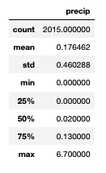
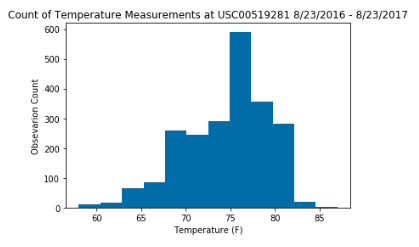

# SQLAlchemy-Weather-Flask-App

### Summary | GRADE: A
For this project, I was given a SQLite file of weather data, which was used to do some analysis in Python using SQLAlchemy and Matplotlib. Then I built a Flask App with various routes that display various data points.

### Project Writeup

#### SQLALchemy Exploration

After linking the given SQLite file to Python, and reflecting the data into classes using the SQLAlchemy automap_base(), I found the latest date in the dataset. Using the split function with datetime, I was able to calculate one year prior to the most recent date. Then I used those dates as bookends to query and plot precipitation levels by date. I also used the pandas .describe() function to get measures of central tendency for precipitation levels. 

          

I also used the dataset to determine the weather station with the most active station, station USC00519281. With that station as a filter, I used SQLAlchemy queries to find the minimum, maximum, and average temperatures. I also used the dates found above to query the observed temperature data and plotted a histogram of occurences. 

#### Flask App API

The second piece of this project was generating a Flask API for various parameters. The requested pages were:
* Dates and precipitation observations of the most active station for the previous year
* All stations
* Dates and temperature observations of the most active station for the previous year
* Given a start date, calculate the minimum, maximum and average temperatures from that date until the end of the data
* When given the start and the end date, calculate the minimum, maximum and average temperatures for dates between the start and end date inclusive.

For each of these pages, I made a Flask route, then performed the queries in a SQL Alchemy Session. Many of these queries wee as those in the previous section. Due to Flask constrains, I needed to unpack this data into a dictionary and then jsonify it to get a readable response. 

#### Temperature Analysis 1

Finally, I completed one of the challenge assignments regarding temperatures in the months of June and Demember. After importing the csv into a pandas dataframe, I use the split and datetime functions to convert the date columns to a datetime format. Then I narrowed my dataframe to get two separate dataframes for June and December. 

Ussing those dataframes, I was able to calculate the mean temperatures for those two months, across all years. I then took a random sample of n=500 from each dataframe to do a ttest to determine of the diferences between those temperature observations was statistically significant. 
I used a two-sided t-test, because the calculated mean difference could be lower or higher, so we need both sides to capture any differences. The t-test yielded a p-value of essentially 0, meaning that there is a statistically significant difference between the mean temperature in June and December.
